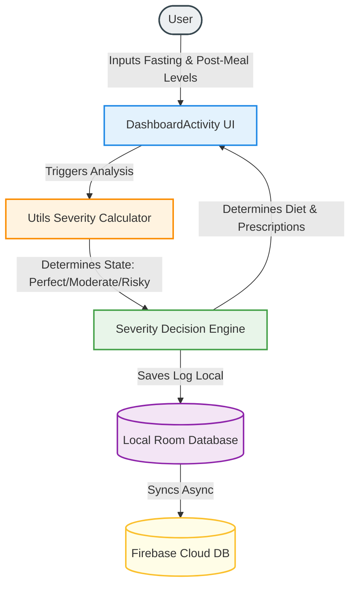

# GlucoGuard: Your Personal Diabetes Assistant 🩸🩺

[](https://developer.android.com/)
[](https://kotlinlang.org/)
[](https://developer.android.com/training/data-storage/room)
[](https://firebase.google.com/)
[](https://developer.android.com/topic/libraries/architecture)

GlucoGuard is a high-performance, user-centric Android application designed to empower individuals managing diabetes. By providing instantaneous severity analysis of blood sugar levels, personalized diet and medication recommendations, secure cloud backup, and robust offline capability, GlucoGuard acts as your comprehensive medical companion.

---

## 📱 Application Interface Mockup

Below is a design mockup of the sleek, dark-themed dashboard interface of the GlucoGuard app, showcasing the inputs, severity card, and tailored suggestions.


---

## ✨ Features & Architecture

### 🎯 Key Highlights
*   **📊 Double-Metric Sugar Tracking**: Log both fasting and post-meal sugar levels simultaneously.
*   **🚨 Automatic Severity Analysis**: Instant calculations classify your condition into actionable states: **Perfect**, **Moderate**, or **Risky**.
*   **🥗 Intelligent Recommendations**: Receive immediate dietary guidance and prescribed medicine suggestions based on your severity category.
*   **☁️ Firebase Cloud Sync**: Real-time backup keeps your profile, medical history, and logs safe across devices.
*   **🔌 Offline Mode (Room DB)**: Access all features and enter metrics offline; changes sync automatically when connectivity is restored.
*   **📅 Trends & Logs**: Keep track of your blood sugar journey over time with an integrated calendar and monthly logging module.

### 🏗️ MVVM System Flow & Data Architecture



---

## 📊 Severity Classification & Rules

GlucoGuard analyzes your blood sugar readings (in mg/dL) using the following logical thresholds defined in `Utils.java`:

| Severity State | Fasting Threshold (mg/dL) | Post-Meal Threshold (mg/dL) | Recommended Diet | Prescribed Action |
| :--- | :--- | :--- | :--- | :--- |
| **🟢 Perfect** | `90 - 140` | `90 - 140` | Balanced Diet, Fruits, Vegetables | No medication required |
| **🟡 Moderate** | `110 - 160` | `110 - 160` | Low Sugar Intake, Whole Grains | Mild Sugar Regulators |
| **🔴 Risky** | `> 200` | `> 200` | Strict Low-Carb Diet, Exercise | Insulin or Stronger Medication |
| **⚪ Unknown** | *Any other range* | *Any other range* | Consult your doctor | Contact medical professional |

---

## 🛠️ Step-by-Step Local Setup & Installation

Follow these steps to import the project and run it on an Android Emulator or physical device:

### 1️⃣ Prerequisites
Make sure you have the following installed on your machine:
*   **[Android Studio](https://developer.android.com/studio)** (Ladybug or newer recommended)
*   **Java SE Development Kit (JDK) 17** or **21**
*   **Android SDK API 34** or higher

### 2️⃣ Clone the Repository
Open your external terminal and run the following command to download the complete codebase:
```bash
git clone https://github.com/Jayavardhan56/Gluco-Guard.git
```

### 3️⃣ Import into Android Studio
1.  Open Android Studio.
2.  Click on **File > New > Import Project...** (or **Open** from the welcome screen).
3.  Select the cloned `Gluco-Guard` folder and click **OK**.
4.  Android Studio will initialize the project and start downloading Gradle dependencies automatically.

### 4️⃣ Setup `local.properties`
Android Studio will generate a `local.properties` file in the root directory. Ensure it points to your correct Android SDK path. For example:
```properties
sdk.dir=C\:\\Users\\YourUsername\\AppData\\Local\\Android\\Sdk
```

### 5️⃣ Connect a Device or Boot Emulator
*   **Emulator**: Go to **Tools > Device Manager** and start a Virtual Device (AVD).
*   **Physical Device**: Enable **USB Debugging** on your Android device (Settings > Developer Options) and connect it via USB.

### 6️⃣ Build and Run
1.  Wait for the Gradle Sync to finish successfully.
2.  Select `app` in the run configurations dropdown at the top.
3.  Click the green **Run (Play)** button or press `Shift + F10` to compile the app and launch it.

---

## ⚠️ Important Medical Disclaimer

> [!WARNING]
> GlucoGuard is designed strictly as an assistant tracking tool and educational application. The suggestions, calculations, and medicine guidelines provided by this app are mock recommendations based on preset rules and **do not constitute professional medical advice, diagnosis, or treatment**. Always consult with a certified healthcare physician or diabetologist before starting any new diet plan or changing medication.

---

## 📧 Feedback & Support

We would love to hear your thoughts and suggestions! Feel free to reach out:
*   📩 **Email**: [akshaysaisree5@gmail.com](mailto:akshaysaisree5@gmail.com)
*   🌐 **GitHub**:[]([https://github.com/akki864)
